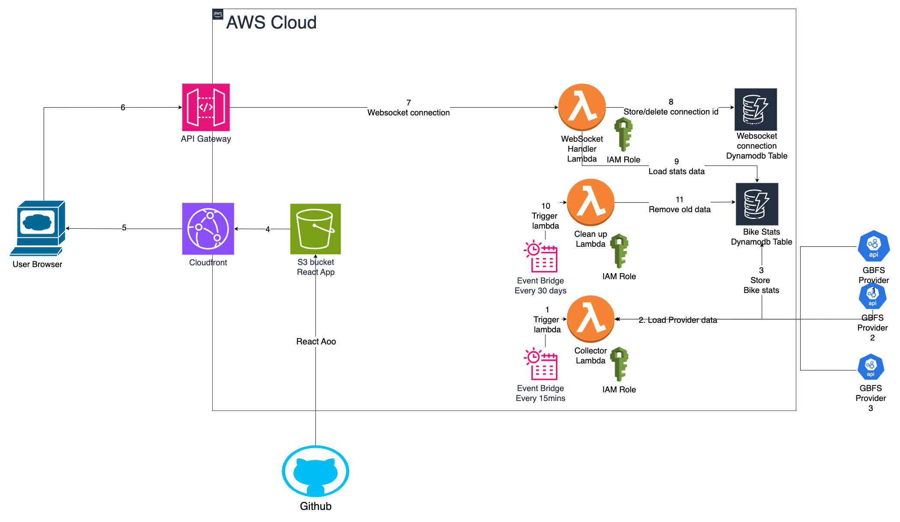
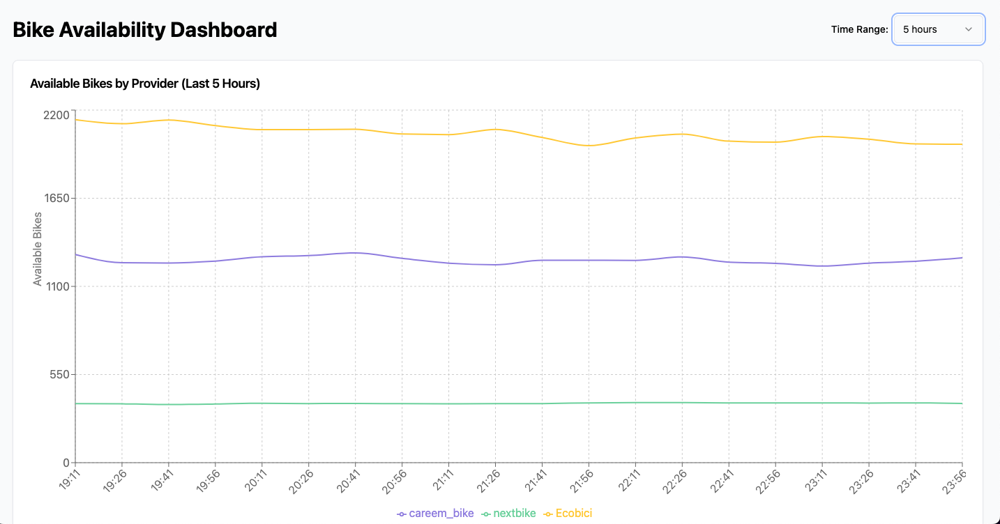

# Bike-Sharing Monitoring System

A real-time monitoring system for bike-sharing services that collects, stores, and visualizes bike availability data from multiple providers using GBFS (General Bikeshare Feed Specification).

## System Architecture

### Components

1. **Frontend (React SPA)**
   - Real-time dashboard showing bike availability
   - Interactive time range selection
   - Multi-provider data visualization
   - Hosted on S3 + CloudFront

2. **Backend Services**
   - **Collector Lambda**: Fetches GBFS data every 15 minutes
   - **WebSocket Handler**: Manages real-time connections and data delivery
   - **Cleanup Lambda**: Removes old data (configurable retention)

3. **Data Storage**
   - **DynamoDB Tables**
     - `bike-stats`: Stores historical bike availability data
     - `connections`: Manages WebSocket connections

4. **Infrastructure**
   - API Gateway (WebSocket API)
   - CloudWatch Events for scheduling
   - IAM roles and policies
   - S3 bucket for static hosting
   - CloudFront distribution
    

## Environment Configuration

### Prerequisites

- AWS CLI configured with appropriate credentials
- Node.js 20.x
- Terraform 1.5.7+
- Git

### Environment Variables

Create environment-specific `.tfvars` files in `terraform/environments/`:

```hcl
# dev.tfvars / prod.tfvars
environment = "dev"  # or "prod"
aws_region  = "ap-south-1"  # your preferred region
```

### AWS Credentials

Set up environment-specific credentials in GitHub Secrets:
- `GBFS_DEV_AWS_ACCESS_KEY_ID`
- `GBFS_DEV_AWS_SECRET_KEY`
- `GBFS_PROD_AWS_ACCESS_KEY_ID`
- `GBFS_PROD_AWS_SECRET_KEY`

## Deployment Process

### Development Environment

1. Create a feature branch:
   ```bash
   git checkout -b feature/your-feature-name
   ```

2. Make your changes and commit:
   ```bash
   git add .
   git commit -m "feat: your feature description"
   ```

3. Push and create a Pull Request to `dev` branch:
   ```bash
   git push origin feature/your-feature-name
   ```

4. The GitHub Action will automatically deploy to dev environment when the PR is merged.

### Production Environment

1. Navigate to GitHub Actions
2. Select "GBFS Deployment" workflow
3. Click "Run workflow"
4. Select "prod" from the environment dropdown
5. Confirm deployment when prompted

## Accessing the Dashboard

### Getting the UI URL

After deployment, you can get the UI URL in two ways:

1. **From Terraform Output**
   ```bash
   cd terraform
   terraform output cloudfront_domain_name
   ```

2. **From AWS Console**
   - Go to CloudFront
   - Find the distribution with tag `Environment = dev/prod`
   - Use the "Distribution Domain Name"

### Using the Dashboard

1. **Time Range Selection**
   - Use the dropdown in the top-right to select data window (1-24 hours)
   - Data updates automatically when range changes
   ```markdown
   
   ```

2. **Provider Data**
   - Each provider has a unique color in the chart
   - Hover over lines to see exact values
   - Legend shows/hides individual providers

3. **Real-time Updates**
   - Data refreshes automatically every 15 minutes
   - WebSocket connection ensures immediate updates

## Configuration Options

### Terraform Variables

| Variable | Description | Default |
|----------|-------------|---------|
| environment | Deployment environment (dev/prod) | Required |
| aws_region | AWS region for deployment | Required |
| project_name | Project identifier for resource naming | "gbfs-monitoring" |

### Lambda Functions

1. **Collector (`collector.zip`)**
   - Environment Variables:
     - `DYNAMODB_TABLE`: Table for bike stats
     - `PROVIDERS`: JSON string of GBFS providers

2. **Cleanup (`cleanup.zip`)**
   - Environment Variables:
     - `DYNAMODB_TABLE`: Table for bike stats
     - `RETENTION_DAYS`: Data retention period
     - `PROVIDERS`: JSON string of GBFS providers

3. **WebSocket Handler (`websocket.zip`)**
   - Environment Variables:
     - `CONNECTIONS_TABLE`: Table for WebSocket connections
     - `BIKE_STATS_TABLE`: Table for bike stats

### DynamoDB Tables

1. **bike-stats**
   - Partition Key: `provider_id` (String)
   - Sort Key: `timestamp` (Number)
   - GSI: `DateIndex` on `date` (String)
   - TTL: `expiry_time`

2. **connections**
   - Partition Key: `connection_id` (String)

## Monitoring and Maintenance

### CloudWatch Logs

- Log groups are retained for 1 day
- Available for all Lambda functions:
  - `/aws/lambda/{env}-{project}-collector`
  - `/aws/lambda/{env}-{project}-websocket`
  - `/aws/lambda/{env}-{project}-cleanup`

### Scheduled Tasks

- Data collection: Every 15 minutes
- Cleanup: Daily
- CloudFront cache: Invalidated on every deployment

## Security

- S3 bucket blocked from public access
- CloudFront OAI for S3 access
- IAM roles with minimal required permissions
- API Gateway throttling configured
- WebSocket connections managed in DynamoDB

## Troubleshooting

1. **WebSocket Connection Issues**
   - Check API Gateway metrics
   - Verify WebSocket URL in React environment
   - Check Lambda logs for connection handling

2. **Missing Data**
   - Verify collector Lambda execution
   - Check DynamoDB capacity and throttling
   - Ensure GBFS provider endpoints are accessible

3. **Deployment Failures**
   - Check GitHub Actions logs
   - Verify AWS credentials
   - Ensure Terraform state is not locked

# System Improvement Recommendations

## 1. Performance Optimizations

### Frontend Improvements
- Implement client-side caching of bike data using browser's localStorage
- Implement progressive loading for historical data
- Implement batch processing for multiple GBFS provider requests

## 2. Reliability & Resilience

### Error Handling
- Add dead-letter queues for failed Lambda executions

### Circuit Breaking
- Implement circuit breakers for GBFS API calls to handle provider outages
- Add fallback mechanisms for failed provider requests

### Connection Management
- Implement WebSocket connection heartbeat mechanism
  
  try {
    const ws = new WebSocket(wsUrl);
    // ... ws setup
  } catch (error) {
    if (retries < maxRetries) {
      setTimeout(() => connectWebSocket(retries + 1), backoff);
    }
  }
}
```

## 3. Scalability Enhancements - Things I can improve


- Add VPC endpoints for enhanced security
- Implement detailed alarm conditions

- Implement JWT authentication for WebSocket connections
### Data Protection
- Add server-side encryption for DynamoDB tables

## 6. Cost Optimization

### Lambda Optimization
- Adjust memory settings based on CloudWatch Insights

### DynamoDB Optimization
- Use TTL more aggressively for old data
- Implement more efficient querying patterns
```

## 7. Developer Experience

### CI/CD Improvements
- Add automated testing for infrastructure changes
- Implement automatic rollback mechanisms
```yaml
jobs:
  test-infrastructure:
    runs-on: ubuntu-latest
    steps:
      - uses: actions/checkout@v2
      - name: Run Terraform Tests
        run: |
          cd terraform
          terraform init
          terraform plan -var-file=test.tfvars
```

### Documentation
- Add automatic API documentation generation
- Implement infrastructure diagrams as code
```hcl
terraform {
  required_version = ">= 1.5.7"
  required_providers {
    diagrams = {
      source = "local/providers/diagrams"
    }
  }
}
```

## 8. Feature Enhancements 


### User Experience
- Add push notifications for low bike availability
- Implement geolocation-based station recommendations

## Implementation Priority

1. High Priority (1-2 months)
   - Error handling improvements
   - Monitoring & observability
   - Security enhancements

2. Medium Priority (3-4 months)
   - Performance optimizations
   - Scalability enhancements
   - Cost optimization

3. Long-term (5-6 months)
   - Feature enhancements
   - Analytics implementation
   - Developer experience improvements

## Next Steps

1. Review and prioritize these improvements based on:
   - Current pain points
   - Resource availability
   - Business impact
   
2. Create detailed implementation plans for each selected improvement

3. Set up tracking metrics to measure the impact of improvements

4. Schedule regular reviews to assess the effectiveness of implemented changes